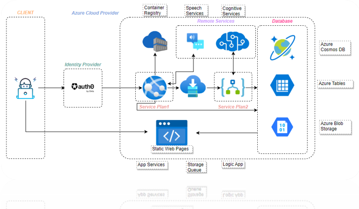

# COM661FullStackBackendAPI

The goal of this assignment was to create a full native cloud video streaming application using azure. There was less emphasis on UI
design and only basic / minimalistic was required. This allow for a more focued approach to backend hosting processes.
The following assets where used when host this application and the code can be found in this repo. Spilt between frontend
and backend code bases:

* Auth0 By Okta
* App Services (Azure)
* Storage Queue (Azure)
* Container Registry (Azure)
* Speech Services (Azure)
* Cognitive Services (Azure)
* Logic App (Azure)
* Cosmos DB (Azure)
* Tables (Azure)
* Blob Storage (Azure)

## System Overview

## Home Page (Initial)

## Login Page Auth0

## Home Page (Login Page)

## Watch Page

## Video Delete

## Azure Example - Logic App

